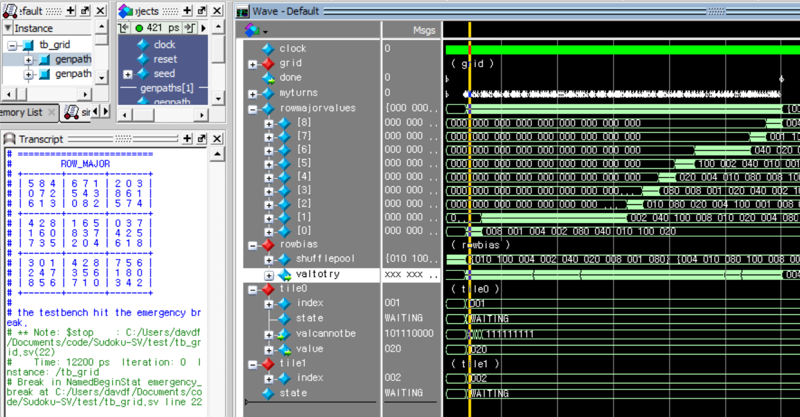

# Sudoku Solution-Generator written in SystemVerilog

Please go to [`my C++ implementation's README`](https://github.com/david-fong/Sudoku-CPP#sudoku-with-c).

You can also watch [a web-based visualizer](https://david-fong.github.io/Sudoku-JS/) I made.

## Interesting Features

- Randomization via [Linear Feedback Shift Register](https://en.wikipedia.org/wiki/Linear-feedback_shift_register#Galois_LFSRs)
- ["Inside-Out"](https://en.wikipedia.org/wiki/Fisher%E2%80%93Yates_shuffle#The_%22inside-out%22_algorithm) Array shuffling and initialization

## Project Status

This project has kind of been a failed experiment. I tried a design based on the idea of a brute force traversal where there is a chain of tiles that take turns to attempt to take on values that are legal in the context of the grid. Giving each tile their unique concept of their context resulted in many logical connections that made it difficult for my synthesis tool to determine a good placement, and impossible for it to realize the placement that I intended. My approach didn't use any RAM blocks, and used something more like a linearized, distributed decision-making system. A different approach that would be much more synthesizer-friendly but also much less interesting (in my opinion) would be to design something like a specialized computer processor- making heavy usage of memories and centralized decision making.
