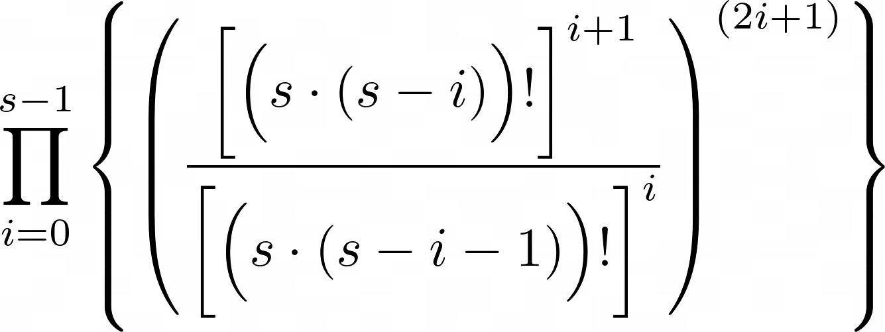

# Sudoku written in SystemVerilog

### Table of Contents:

- [Sudoku in a Nutsheel](#sudoku-in-a-nutshell)
- [Wikipedia Links](#wikipedia-links)
- 

## Sudoku in a Nutshell

Sudoku is a common puzzle game often found in newspapers where the goal is to re-construct a square grid of symbols according to simple conflict rules. The grid is defined by a size argument `S` which is typically three, and is composed of `S^4` atomic containers that can carry one of certain symbols, of which there are the same `S^2` for each container in the grid (typically the numbers one through `S^2`). The only rule is that no row, column, or block can contain duplicate symbols. In other words, each row, column, and block must contain one of each symbol. It's a lot easier said than done.

Puzzles are computer-generated in such a way that there is at least enough starting information for there to be only one solution (ie. There are no two ways to complete the grid that produce the same arrangements of symbols). This can be done by brute-forcing the creation of a full solution, and then incrementally erasing symbols at random until any further erasure would allow for multiple valid completions of the grid.

The systematic processes of solving a puzzle and of generating a solution using backtracing (brute force) are actually the same. The defining differences are in how they start and end. When generating a solution, there is no starting information, and a very large (but computable and finite) number of possible completions. When solving a puzzle, there is at least enough starting information such that there is only one possible completion.

## Wikipedia Links

- [Sudoku (Topic Homepage)](https://wikipedia.org/wiki/Sudoku)
- [Mathematics of Sudoku](https://wikipedia.org/wiki/Mathematics_of_Sudoku)
- [Sudoku Solving Algorithms](https://wikipedia.org/wiki/Sudoku_solving_algorithms)

## Solution Space

We can compute some easier ceilings on the number of unique solutions (including those that are symbolically and/or relationally equivalent) first to help get an idea of the scale of things. We know it must be equal to or less than the number of symbol arrangments that do not need to follow the rules, which is `(S^2)^(S^4)`. We know that each group of the same kind cannot contain duplicate elements, so it must be equal to or less than `((S^2)!)^(S^2)`, which is the number of symbol arrangements where the conflict rule is only applied to groups of one chosen type.

The true number of all solutions can be calculated by taking the product of the number of symbol options for each container as they are procedurally filled-in according to a conflict-heavy traversal order for solution generation. Symbol option counts should be taken pessimistically: Use the complement of the maximum occupancy count across the three related group types. That is, if the next container to fill in the theoretical generation traversal for a size-3 grid is in a row occupied by 3 other symbols, a column by 5, and a block by 2, then the pessimistic number of symbol options for that container is `9 - max(3,5,2) = 4`.

The equation described above would be quite complex. As a first step, we can take a slightly simplified version that is still a provable ceiling for the size of the solution space (but is still not the lowest provable ceiling). The traversal order travels over all blocks in row-major order, and at each block, traverses it at once internally- also in row-major order.

`TODO: create diagrams illustrating the logic and insert them here.`

The above diagram shows that for a block `B_i,j`, the number of combinations of symbols according to this traversal order is no more than:



The above formulae can be viewed [here on desmos](https://www.desmos.com/calculator/qfclkf3jr1), or pasted into desmos using the below latex:

```latex
f_{0}\left(s\right)=\left(s^{2}\right)^{s^{4}}
f_{1}\left(s\right)=\left(s^{2}!\right)^{s^{2}}
f_{2}\left(s\right)=\prod_{i=0}^{s-1}\left(\frac{\left[\left(s\left(s-i-0\right)\right)!\right]^{\left(i+1\right)}}{\left[\left(s\left(s-i-1\right)\right)!\right]^{\left(i\right)}}^{\left(2i+1\right)}\right)
```

## Time Complexity


